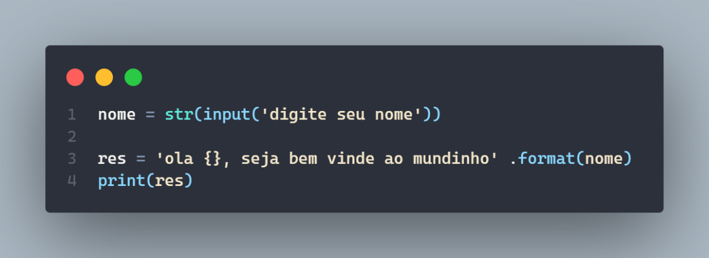
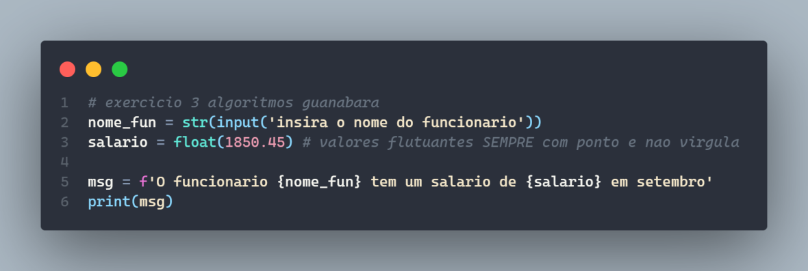

# phytonClasses
meus exercícios de phyton (do zero) - todos os exercicios de iniciante que fiz no phyton

### exercicio de algoritmos - lista guanabara
2) Faça um programa que leia o nome de uma pessoa e mostre uma mensagem de boas vindas para ela:  
Ex: Qual é o seu nome? João da Silva  
Olá João da Silva, é um prazer te conhecer!  
meu codigo: (exercicio feito com funcao de inserir nome)

#
3) Crie um programa que leia o nome e o salário de um funcionário, mostrando no final uma mensagem.  
Ex: Nome do Funcionário: Maria do Carmo  
Salário: 1850,45  
O funcionário Maria do Carmo tem um salário de R$1850,45 em Junho.  
meu codigo: (exercicio feito com funcao de inserir dado - nome do funcionario) 

